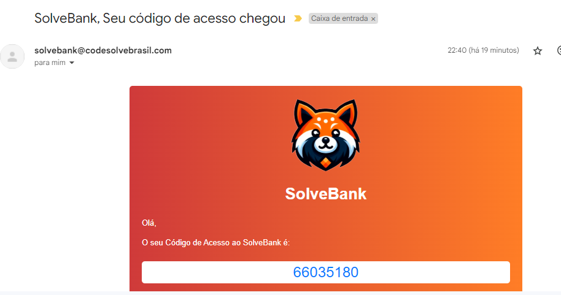
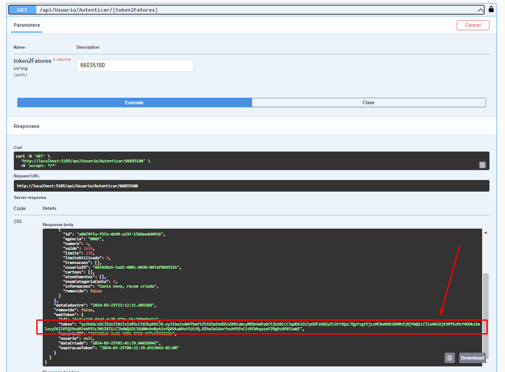
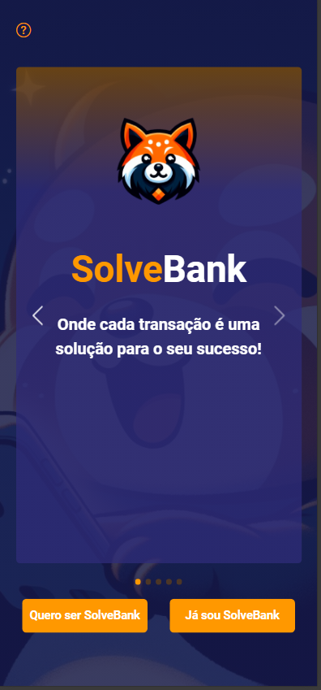
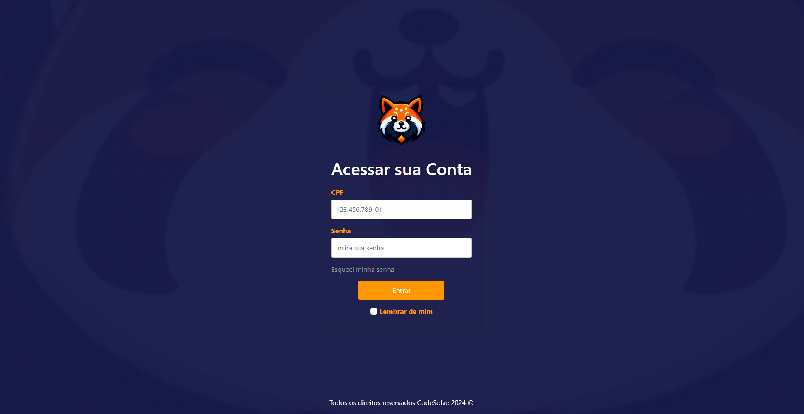

# Bem-vindo(a) ao SolveBank🏦


## Sobre nós

| Bem-vindo(a) ao SolveBank, onde sua jornada financeira ganha vida! Estamos comprometidos em proporcionar uma experiência bancária moderna, conveniente e segura para nossos clientes. Nosso objetivo é simplificar sua vida financeira, oferecendo uma ampla gama de serviços e soluções adaptadas às suas necessidades individuais |     |
| ----------------------------------------------------------------------------------------------------------------------------------------------------------------------------------------------------------------------------------------------------------------------------------------------------------------------------------- | --- |

## Índice

- [Funcionalidades da Aplicação](#nosso-aplicativo)
- [Como Instalar](#como-instalar)
- [Demonstração](#demonstração)
- [Status do Projeto](#status)
- [Contato](#contato)

## Nosso Aplicativo

**Nosso aplicativo é o seu portal para todas as suas necessidades financeiras.** Com uma interface intuitiva e recursos poderosos, estamos aqui para ajudá-lo a gerenciar seu dinheiro de forma inteligente e eficiente. Você pode acessar o aplicativo pelo site https://solvebank.codesolvebrasil.com .

É possível acessar a simulação do caixa eletrônico pelo site https://solvebank.codesolvebrasil.com/external/login .

Aqui estão alguns dos recursos que você encontrará em nosso aplicativo:

### 1. Conta Bancária

- **Gerencie sua conta facilmente:** Acesse saldos, extratos e histórico de transações com apenas alguns toques.
- **Transações seguras:** Realize transferências entre contas, pagamentos de contas e agendamentos de pagamentos com total segurança.

### 2. Segurança Avançada

- **Proteção de dados:** Utilize autenticação biométrica, como impressão digital ou reconhecimento facial, para garantir a segurança de suas informações financeiras.
- **Transações seguras:** Conte com medidas de segurança avançadas para proteger suas transações online contra fraudes e ameaças cibernéticas.

## Tecnologias

- C#
- .NET
- Angular
- TypeScript
- Git
- MySQL (online)

### Arquitetura e regras de negócio

- Princípio SOLID de responsabilidade única, tanto Front como Back-end.
- Front-end pensado como uma tela de caixa eletrônico que faz depósito, transferência e saque.
- Banco de dados online, não é necessário fazer migrations do banco, pois a conexão com o banco de dados online é feita automaticamente
- Back-end dividido em pastas, diferenciando suas responsabilidades
    -  SolveBank.Entities
        - Armazena os Models
        - Enums
        - DTOs (Data Transfer Objects)
    - SolveBank.Infrastrutucture
        - Armazena a configuração do banco de dados
        - Migrations
        - Serviços (responsáveis pela interação com banco de dados)
        - Contratos dos serviços (interfaces com os métodos para os serviços)
    - WebApiSolveBank
        - Armazena os controlares que irão receber as chamadas de API e associa com os serviços para executar alguma ação.
        - Faz a integração com SolveBank.Entities e SolveBank.Infrastrutucture
- Autenticação por 2 fatores
    - Ao preencher a senha, será enviado um email com o token de acesso
    - Token de acesso válido por 10 minutos
- Json Web Token (JWT)
    - camada de segurança, em que faz a autenticação do usuário e autorização, tornando a troca de informações entre o nosso Front-end com o Back-end.


## Como instalar

### Iniciando Front-end
Em seu terminal, faça um clone do repositório
```
git clone https://github.com/Code-Solve/SolveBank.git
```
Entre na pasta "FrontEnd" pelo terminal
```
cd SolveBank/FrontEnd
```
Execute a instalação dos módulos
```
npm install
```
Inicialize o server do Angular com o comando abaixo
```
ng serve
```
Acesse o site pelo caminho http://localhost:4200/

### Iniciando Back-end

Em seu terminal, entre na pasta "BackEnd"
```
cd SolveBank/BackEnd/WebApiSolveBank/WebApiSolveBank
```
Inicialize o servidor .NET com o comando abaixo
```
dotnet run
```

### Integrando Back-end com Front-end
Entre no arquivo no caminho "FrontEnd/src/app/services/uriGlobalAcess.ts".
Edite esse arquivo com a URL que o .NET forneceu com "/api/" no final
```ts
// Exemplo
export const uri = 'https://localhost:44373/api/'; 
```

## Demonstração Swagger
Acesse o swagger pela link que o .NET fornece Ex: "https://localhost:44373/swagger".

Preencha a requisição  da API "/api/Usuario/cadastrar" com o campo de senha com caracteres especiais, maiúsculas, minúsculas e números. Coloque um email que você tem acesso, pois nele você receberá o token de autenticação.

Preencha a requisição da API "/api/Usuario/login" com seu usuario e senha do passo anterior, após executá-la, você receberá um email com o token de verificação.



Preencha e execute a requisição da API "/api/Usuario/autenticar/" com o token fornecido no email. Copie campo token dentro do "webtoken" da resposta da API.



Na parte superior da página, clique no botão "Authorize" e cole o token. Agora as chamadas de API terão em seu header o token de acesso para esse usuário. Esse token é válido por 10 minutos.

## Demonstração aplicação

**Aqui estão algumas capturas de tela do nosso aplicativo:**


_**Tela de Landing Page, versão mobile.**_ 📲


_**Tela de Login, versão desktop.**_ 💻

## Status

O projeto "SolveBank" está atualmente em sua fase de planejamento, com cerca de 60% concluído. Nossa equipe está focada na definição da visão estratégica, mapeamento dos requisitos e arquitetura do sistema. Buscamos oferecer uma experiência bancária inovadora, integrando tecnologias avançadas e visando a competitividade no mercado financeiro. O "SolveBank" está comprometido em liderar a transformação digital do setor, priorizando a excelência e a satisfação do cliente.


[www.codesolve.com.br](https://codesolve.marcusvogado.com/home)

---


